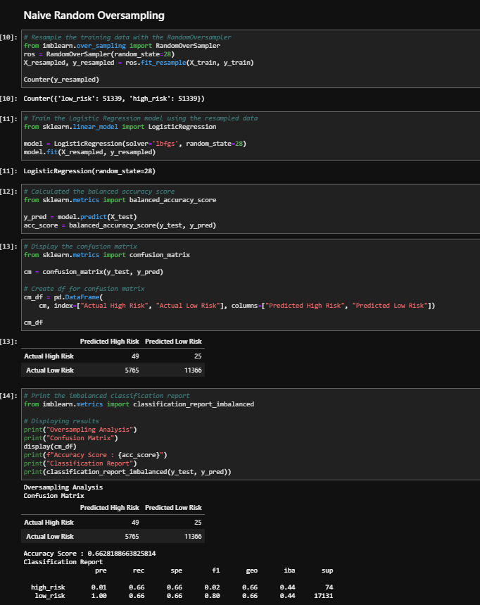
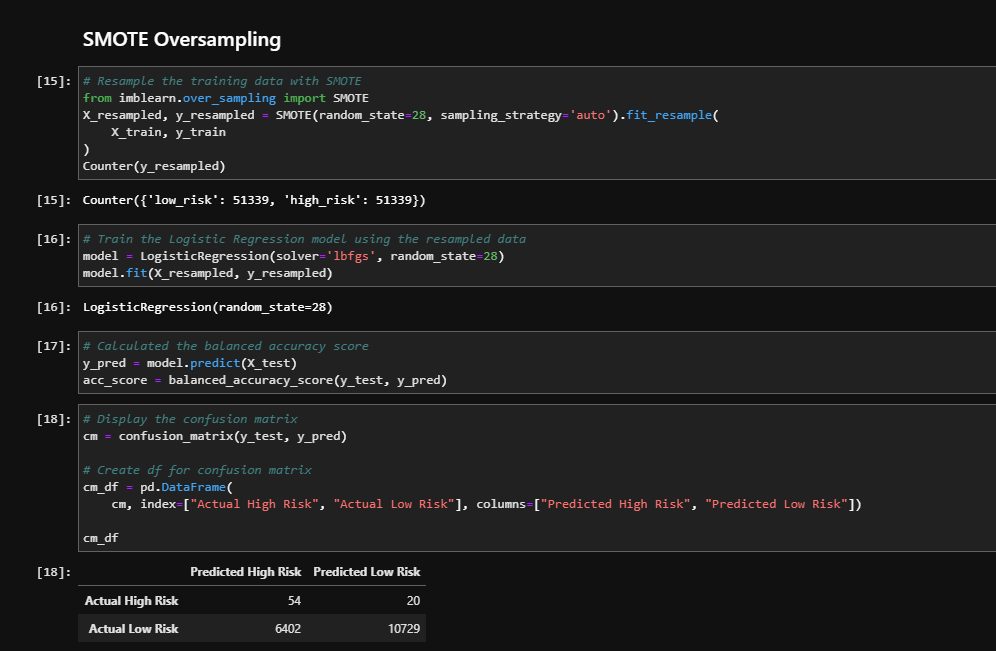
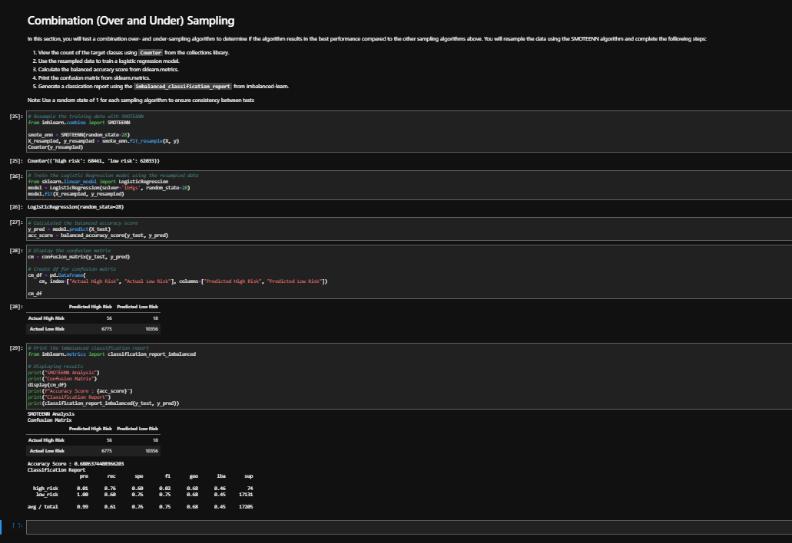
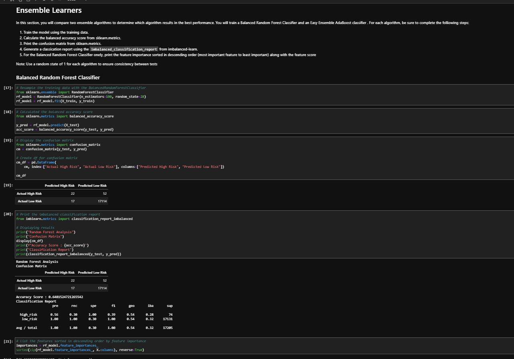
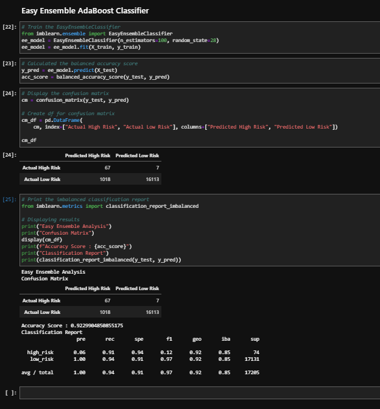

# -Credit_Risk_Analysis-

# Overview of the analysis:

Jill commends you for all your hard work. Piece by piece, you’ve been building up your skills in data preparation, statistical reasoning, and machine learning. You are now ready to apply machine learning to solve a real-world challenge: credit card risk.

Credit risk is an inherently unbalanced classification problem, as good loans easily outnumber risky loans. Therefore, you’ll need to employ different techniques to train and evaluate models with unbalanced classes. Jill asks you to use imbalanced-learn and scikit-learn libraries to build and evaluate models using resampling.

Using the credit card credit dataset from LendingClub, a peer-to-peer lending services company, you’ll oversample the data using the RandomOverSampler and SMOTE algorithms, and undersample the data using the ClusterCentroids algorithm. Then, you’ll use a combinatorial approach of over- and undersampling using the SMOTEENN algorithm. Next, you’ll compare two new machine learning models that reduce bias, BalancedRandomForestClassifier and EasyEnsembleClassifier, to predict credit risk. Once you’re done, you’ll evaluate the performance of these models and make a written recommendation on whether they should be used to predict credit risk.

What You're Creating
This new assignment consists of three technical analysis deliverables and a written report. You will submit the following:

Deliverable 1: Use Resampling Models to Predict Credit Risk
Deliverable 2: Use the SMOTEENN Algorithm to Predict Credit Risk
Deliverable 3: Use Ensemble Classifiers to Predict Credit Risk
Deliverable 4: A Written Report on the Credit Risk Analysis (README.md)

# Results: 
Using bulleted lists, describe the balanced accuracy scores and the precision and recall scores of all six machine learning models. Use screenshots of your outputs to support your results

## Deliverable 1: 
Use Resampling Models to Predict Credit Risk

Using your knowledge of the imbalanced-learn and scikit-learn libraries, you’ll evaluate three machine learning models by using resampling to determine which is better at predicting credit risk. First, you’ll use the oversampling RandomOverSampler and SMOTE algorithms, and then you’ll use the undersampling ClusterCentroids algorithm. Using these algorithms, you’ll resample the dataset, view the count of the target classes, train a logistic regression classifier, calculate the balanced accuracy score, generate a confusion matrix, and generate a classification report.

## Deliverable 2: 
Use the SMOTEENN Algorithm to Predict Credit Risk

Using your knowledge of the imbalanced-learn and scikit-learn libraries, you’ll use a combinatorial approach of over- and undersampling with the SMOTEENN algorithm to determine if the results from the combinatorial approach are better at predicting credit risk than the resampling algorithms from Deliverable 1. Using the SMOTEENN algorithm, you’ll resample the dataset, view the count of the target classes, train a logistic regression classifier, calculate the balanced accuracy score, generate a confusion matrix, and generate a classification report.

## Deliverable 3: 
Use Ensemble Classifiers to Predict Credit Risk

Using your knowledge of the imblearn.ensemble library, you’ll train and compare two different ensemble classifiers, BalancedRandomForestClassifier and EasyEnsembleClassifier, to predict credit risk and evaluate each model. Using both algorithms, you’ll resample the dataset, view the count of the target classes, train the ensemble classifier, calculate the balanced accuracy score, generate a confusion matrix, and generate a classification report.

# Summary: 

Summarize the results of the machine learning models, and include a recommendation on the model to use, if any. If you do not recommend any of the models, justify your reasoning.

After factoring in these three main statistics, the model that I would recommend to use for predicting high-risk loans is the Easy Ensemble Classifying model.
This model has the highest recall rate for high-risk loans and the highest accuracy score. The recall rate for high-risk loans is important because it shows how many high-risk loans are being flagged as high risk. Accuracy is also important because you want to make sure that the model is not flagging too many low-risk loans as high risk. This model has both of these statistics in its favor, making it the best model for this scenario.

The main advantage of the ensemble method is that it can overcome the limitations of the base classifiers. In the same way, it can achieve a better classification accuracy than the base classifiers.  The main disadvantage of the ensemble method is that it requires a lot of computational resources. It is because the decision trees are trained and tested in parallel in each iteration.  The analisis shows the comparison of accuracy between the Easy Ensembled Adaboost and the SMOTE Oversampling

- Easy Ensemble Classifying (91%)
- SMOTEENN Sampling (76%)
- Naive Random Oversampling (72%)

- Balanced Random Forest Classifying (100%)
- Easy Ensemble Classifying (94%)

- Easy Ensemble Classify (92.3%)
- SMOTEENN Sampling (68.1%)
- Balanced Random Forest Classifying (64.8%)

In conclusion, I created a machine learning model to determine whether or not a loan would be granted based on several different factors. I then tested this model against a test dataset and found that it was able to correctly identify low and high risk loans with an accuracy rate. This shows that this machine learning model can be used in practice to accurately identify which loans should be approved and which should not be approved based on their level of risk. This is important because it means that this machine learning model can be used in practice to accurately identify which loans should be granted and which should not be granted, which saves money for the bank by only approving the most profitable loans while rejecting the less profitable ones. This is important because it means that this machine learning model can be used in practice to accurately identify which loans should be granted and which should not be granted, which saves money for the bank by only approving the most profitable loans while rejecting the less profitable ones.

